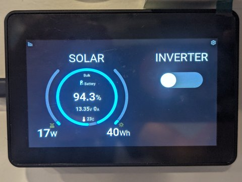
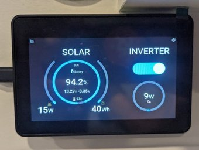
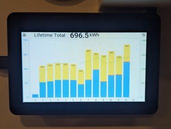
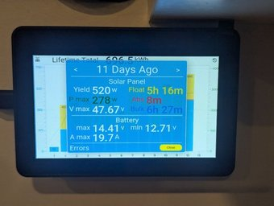
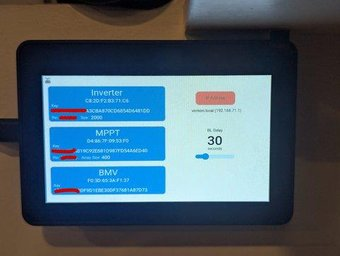

# Victron Monitoring and Inverter switch

Display an overview like the GX screen, and allow turning the inverter on and off. It can also show
14 days of history from the MPPT. It runs on a [$45 ESP32 display](https://www.waveshare.com/esp32-s3-touch-lcd-4.3b.htm?sku=28141)

Unlike the GX, or Venus OS on a PI, it's all bluetooth, there are no cables needed for the inverter control 
or mppt history. 

This display can be powered through either a usb c cable, or wired 5v directly into display. In theory the board
has a regulator that supports 12v (to 36v) on the wire but I fried mine when I connected it straight to the van 12v so 
I'm not sure what voltage it actually supports (I have successfully used a regulated 5v line into the VIN)

I have a 12V camper van:
* 400W (2x200W panels)
* MPPT SmartSolar 100/30
* VE.Bus Smart Dongle - this is the ble interface with the multiplus
* Multiplus II 12/2000 80-50
* BMV 712
* DC-DC 12|12 30A - this is not being monitored
* 200ah (2x100ah battleborn batteries)

## Bluetooth

All communication is done using Bluetooth BLE. The monitoring is using Victron's 
[BLE advertising data](https://community.victronenergy.com/questions/187303/victron-bluetooth-advertising-protocol.html). 
The inverter control and MPPT history are done by connecting to the device and issuing BLE commands to the service characteristics just like the Victron Connect phone app.

To use the advertising data the mac and encryption key are required, which can be retrieved from the Victron Connect app. To turn the inverter on/off or get MPPT history the device BLE pin is required.

I use the [victron_ble](https://github.com/felixwatts/victron_ble) crate for the decoding.

### Configuration

There is a configuration screen that shows the device mac, key and pin. On this page the wifi can be turned on 
which creates a network called "vicmon" and exposes a configuration web page 
on [http://vicmon.local](http://vicmon.local) where the device details can be entered. 
You need to join the vicmon network and open the browser to vicmon.local. From the Victron Connect app you can 
cut/paste the mac and key from the device product details page into the vicmon configuration page. Configuration changes
are persisted to nv ram.

# Victron Connect App BLE protocol

Using wireshark to get the BT attribute protocol commands while interacting with the Victron Connect app I was
able to reverse engineer some of the operations, like inverter control and history. The protocol is essentially a
wrapper around the VE.Direct and VE.Bus/CAN protocols, of which Victron has published register details so if you
can figure out how to issue commands and get responses through the gattc characteristics parsing the responses
is relatively straight forward.

* [VE.Bus registers](https://www.victronenergy.com/upload/documents/VE.Can-registers-public.pdf)
* [VE.Direct for MPPT](https://www.victronenergy.com/upload/documents/BlueSolar-HEX-protocol.pdf)

I am no Bluetooth expert and far from understand how BLE is supposed to work so please excuse my mistakes and misdirections.

## GATTC Services and Characteristics

For the two devices I was connecting to the services and characteristic UUIDs and interactions where the same, so I 
assume this would be the case for all their devices.

There are several services but only 1 service and it's characateristics appears to be used for interacting with the registers.
The protocol mainly revolves around writing commands to 2 characteristics and a third characteristic used for 
control flow. Responses come in the form of notifications from the characteristics.

You write a command, such as get history for day 3, and the response will come at some point in a notification. 
Some commands result in repeated notifications as the data changes over time, such as panel voltage, like the 
advertising data.

## Security

I set the gap authentication request mode to MITM with bonding and use device capabilities keyboard only. This
means the esp will bond after the first successful pin key exchange and the esp will get a gap passkey event
that must be replied to with the 6 digit passkey or pin. 

All writes use the auth request MITM. Characteristic writes, for commands, have no response while descriptor
writes for notification do require response.

You can connect and search for services and get characteristics/descriptors without authentication but the first write, 
which requires MITM, will trigger the passkey exchange.

Nordic's nRF Connect app is able to connect and show all the services and characteristics but isn't able to 
get notifications or write to characteristics because it doesn't use MITM. At least I couldn't get it to work with
Victron devices so it wasn't very useful here.

## Service UUID: 306B0001B081403783DCE59FCC3CDFD0

<<<<<<< HEAD
=======
<<<<<<< HEAD
>>>>>>> 8d2b816 (Add docs)
| UUID | Description |
| --- | --- |
| 306B0002B081403783DCE59FCC3CDFD0 | Flow Control (FC) Characterisitic |
| 306B0003B081403783DCE59FCC3CDFD0 | Command (C) Characterisitic |
| 306B0004B081403783DCE59FCC3CDFD0 | Long Command (LC) Characterisitic |
<<<<<<< HEAD
=======
=======
| Characteristic UUID | Description |
| --- | --- |
| 306B0002B081403783DCE59FCC3CDFD0 | Flow Control (FC) Characterisitic (VictronConnect App handle: 21) |
| 306B0003B081403783DCE59FCC3CDFD0 | Command (C) Characterisitic (VictronConnect App handle: 24) |
| 306B0004B081403783DCE59FCC3CDFD0 | Long Command (LC) Characterisitic (VictronConnect App handle: 27) |
>>>>>>> c38c5aa (Add docs)
>>>>>>> 8d2b816 (Add docs)

Each characterisitic has a Client Characterisitic Configuration descriptor (CCCD), UUID 2902, that
needs to be notified by gattc registering for notify on the characterisitic and writing 1 to the descriptor.

<<<<<<< HEAD
=======
<<<<<<< HEAD
=======
The VictronConnect App service, characteristic and descriptor handles are different than the handles the esp32 gets, so
you should always use the ble api's to get the handles.

>>>>>>> c38c5aa (Add docs)
>>>>>>> 8d2b816 (Add docs)
## MTU

The mtu looks to be limited to 77 bytes, even if a larger one is requested. This means characteristic writes 
are limited to this size. However, I found I couldn't write more than 74 bytes? This required me to split the 
mppt history register request into a long command.

## Requests and Long Requests

A request can be a get or a set command, like get a history day register or set inverter mode.

More than one request can be issued in a single command. If the number of bytes in the command exceeds the
MTU size (74 bytes?) it must be split into at most two long commands ending with a command. The device will
concatinate the long commands and command back together to reconstitute the full byte sequence, so a register request
could be broken between long commands and the ending command.

I need to get 14 history day registers and the history lifetime register, each register request is 6 bytes so I have
to split this into one long command characteristic write followed by a command characteristic write.

You write to the characteristics and once the final command characteristic is written you need to wait for a FC 
notification of f901, this notifies command recieved and more commands characteristics may be written to.

I.E.

1. Write to LC -> 74 bytes...
1. Write to C -> 20 bytes...  (total request bytes 94)
1. Notify from FC <- f901  at some point in the future, other notifications may arrive in between.
1. Write to C -> 35 bytes...  (total request bytes 35)
1. Notify from FC <- f901  at some point in the future, other notifications may arrive in between.
 
## Responses and Long Responses

Responses come in the form of notifications from the characteristics.

Like requests, responses that exceed the MTU (74 bytes?) are split over the long command characteristic and the 
command characteristic. A notify from the LC needs to be concatinated with the next LC, if there is one, ending 
with the next C, thus reconstituting the full byte sequence which can then be parsed.

I.E.

1. Notify from LC <- 74 bytes...
1. Notify from C <- 20 bytes... (total response bytes 94)
1. Notify from C <- 35 bytes... (total response bytes 35)
1. Notify from C <- 42 bytes... (total response bytes 42)

## Startup

After subscribing to notifications on each characteristic a sequence of startup commands need to be issued:

1. Write to FC -> fa80ff
1. Write to FC -> f980
1. Notify from FC <- f901

1. Write to C -> 01
1. Notify from FC <- f901

Now we can start writing commands. 

### Inverter
However, for the inverter control I did not need to get notifications nor issue the startup sequence. As soon as as the 
service is found I get the command characteristic, write the inverter command, on or off, and then immediately 
disconnect. This means I don't capture the actual inverter command notification response and consequently any errors,
like a voltage ripple, that might have occurred. To just turn the inverter on or off this seems efficient and 
fast, if there are issues then the Victron Connect app can still be used. 

### MPPT needs an another startup command
1. Write to C -> 0303
1. Notify from FC <- f901

And then I could write the history command read requests (FC, C). I think send 0303 tells the MPPT to allow 
accepting register read requests, without it the register values would never be notified. 
It also starts to notify a whole lot of other register values I did not ask for?  

## Keep alive

Every so often, perhaps 30 seconds or less? a keep alive f941 needs to be sent to the FC. 
I have not need to use this as both the inverter and mppt commands are issued and then the connection is closed. I guess
if you need a long running connection this needs to be sent.

## Request and Response register commands

This is where things get very hazy... Take all of this with a pinch of salt.

There are register read requests (and write requests), and register responses. The register ID's remain the same 
in both but the request and response prefixes change.

To request a history day 0 register (0x1050) the full sequence is 0x050381191050 and the response 
will be 0x08031910505822xxxx... where xxxx are the register payload. To break these down...

### 0x050381191050 - read history day 0 register
<<<<<<< HEAD
- 05 read request type (read)
- 03 class? standard register? 01 for product?
- 81 read? 82 on 06 request type - write?
=======
<<<<<<< HEAD
- 05 read request type (read)
- 03 class? standard register? 01 for product?
- 81 read? 82 on 06 request type - write?
=======
- 05 command request type (read)
- 03 class? standard register? 01 for product?
- 81 register operation (read)
>>>>>>> c38c5aa (Add docs)
>>>>>>> 8d2b816 (Add docs)
- 19 register ID byte count (2)
- 1050 register ID (day 0)

### 0x08031910505822xxxx - value history day 0 register
<<<<<<< HEAD
- 08 read response type (data typed)
=======
<<<<<<< HEAD
- 08 read response type (data typed)
=======
- 08 command response type (data typed)
>>>>>>> c38c5aa (Add docs)
>>>>>>> 8d2b816 (Add docs)
- 03 class? standard register?
- 19 register ID byte count (2)
- 1050 register ID (day 0)
- 58 data type (payload)
- 22 bytes in payload (34 bytes)

### 0x0603821902004103 - write inverter ON mode
<<<<<<< HEAD
- 06 write request type (write)
- 03 standard register
- 82 write?
=======
<<<<<<< HEAD
- 06 write request type (write)
- 03 standard register
- 82 write?
=======
- 06 command request type (write)
- 03 standard register
- 82 register operation (write)
>>>>>>> c38c5aa (Add docs)
>>>>>>> 8d2b816 (Add docs)
- 19 register ID byte count (2)
- 0200 register ID (controlling device mode - inverter mode)
- 41 data type (un8)
- 03 write data value (03 On)

<<<<<<< HEAD
## Request Type

What are we doing to the register.
=======
<<<<<<< HEAD
## Request Type

What are we doing to the register.
=======
## Command, request Type

Command operation, used when writing to command characterisitics
>>>>>>> c38c5aa (Add docs)
>>>>>>> 8d2b816 (Add docs)

| Hex | Description |
| --- | --- |
| 05 | read |
| 06 | write |

<<<<<<< HEAD
## Response Type

How is the register value determined, for reading values.
=======
<<<<<<< HEAD
## Response Type

How is the register value determined, for reading values.
=======
## Command, response Type

Command operation, used in command notify responses. How is the register value determined, for reading values.
>>>>>>> c38c5aa (Add docs)
>>>>>>> 8d2b816 (Add docs)

| Hex | Description |
| --- | --- |
| 07 | no idea, e.g. 0x07000300 | 
| 08 | read value, data typed - need to get the data type of the register, next byte after register ID is the data type  |
| 09 | read value, boolean - boolean value is the next byte after register ID |

## Class/register type/group

I don't know. Seems to be 03 for documented registers. I've seen 00 when requesting serial numer 0x010A. I've also seen 01 and 02 and 03 for the same 0x010A ID and these returned a boolean 09 response instead of the serial number?

## Register Operation

What are we doing to the register when writing to command characteristic.

| Hex | Description |
| --- | --- |
| 81 | read, used with request type 05 |
| 82 | write, used with request type 06 |

## Register ID byte count

Length of register ID

| Hex | Description |
| --- | --- |
| 18 | 1 byte |
| 19 | 2 bytes |

## Data Type

When reading or writing a non boolean register (response type 8), the byte after the ID is the data type.

| Hex | Data type |
| --- | --- |
| 41 | un8 |
| 42 | un16,sn16 2 bytes |
| 44 | un32,sn32 4 bytes |
| 46 | 6 bytes |
| 4b | string, terminated by 4b? |
| 4c | string, 00 terminated? |
| 50 | 8 bytes |
| 58 | payload/array, the next byte is how many bytes in the payload/element, possibly followed by another 58 |
5b

## More Resources

Other projects that have examined the Victron Connect protocol:

* https://github.com/vvvrrooomm/victron - Wireshark dissector sort of works, doesn't handle long responses, I don't use it.
* https://github.com/birdie1/victron
* https://github.com/Olen/VictronConnect
